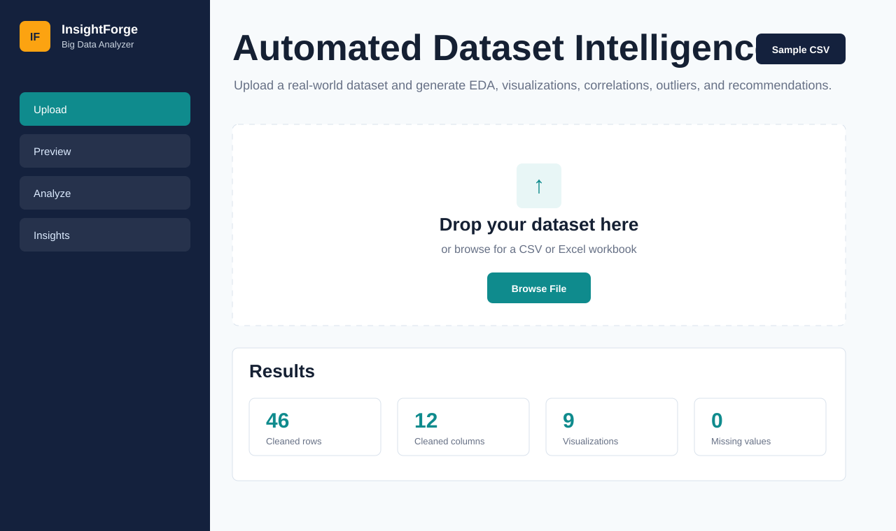

# InsightForge Big Data Analyzer

InsightForge is a full-stack FastAPI web app for automated dataset analysis. Users upload a CSV or Excel workbook, preview the first rows, run one-click EDA, and receive interactive Plotly charts, statistics, pattern detection, and business-ready conclusions.

## Features

- Drag-and-drop or browse upload for `.csv`, `.xlsx`, and `.xls` files up to 50 MB
- Backend parsing with pandas and automatic cleaning for duplicates, missing values, datetimes, numeric fields, and categorical fields
- Column profiling for numeric, categorical, datetime, and text fields
- Interactive Plotly visualizations: trend/area chart, bar chart, donut chart, histograms with box summaries, scatter plot with regression line, violin plot, and correlation heatmap
- Automated statistics: descriptive metrics, top categorical values, strongest correlations, and z-score outlier detection
- AI-assisted insight narrative written by deterministic analytic rules, with a clear extension point for OpenAI, Groq, LangChain, CrewAI, or LlamaIndex
- Graceful API errors for empty files, unsupported formats, oversized files, and analysis failures

## Project Structure

```text
app/
  analyzer.py          # pandas cleaning, profiling, charts, insights
  main.py              # FastAPI routes and static app serving
  static/              # single-page frontend
samples/
  car_sales.csv        # realistic sample dataset
reports/
  sample_report.html   # generated sample report
slides/
  insightforge-architecture.pptx
tests/
  test_analyzer.py
```

## Setup

```bash
python3 -m venv .venv
source .venv/bin/activate
pip install -r requirements.txt
uvicorn app.main:app --reload
```

Open `http://127.0.0.1:8000` in your browser.

## Run Tests

```bash
python3 -m unittest
```

## API

### `POST /api/analyze`

Multipart form upload field: `file`

Returns one JSON object containing:

- `preview`: first 20 cleaned rows
- `summary`: original and cleaned shape, missing values, data types, and detected column types
- `statistics`: descriptive stats, top correlations, categorical leaders, and outliers
- `visualizations`: Plotly figure JSON objects
- `insights`: natural-language findings
- `conclusions`: final recommendation narrative

## Sample Dataset And Report

Use [samples/car_sales.csv](samples/car_sales.csv) to test the app. A generated example report is included at [reports/sample_report.html](reports/sample_report.html), and a 6-slide presentation deck is included at [slides/insightforge-architecture.pptx](slides/insightforge-architecture.pptx).

## Screenshot



## Optional AI Agent Integration

The current insight engine is deterministic so the project runs locally without API keys. To add an LLM, pass the JSON returned by `analyze_dataframe` into your preferred agent framework and replace or augment the `insights` and `conclusions` fields. Recommended prompt input: schema summary, top correlations, chart titles, outliers, and high-cardinality segments.

## Demo Checklist

1. Start the server with `uvicorn app.main:app --reload`.
2. Open the web app.
3. Upload `samples/car_sales.csv`.
4. Confirm the preview table appears.
5. Click **Analyze Dataset**.
6. Show charts, statistics, insights, and final conclusions.
